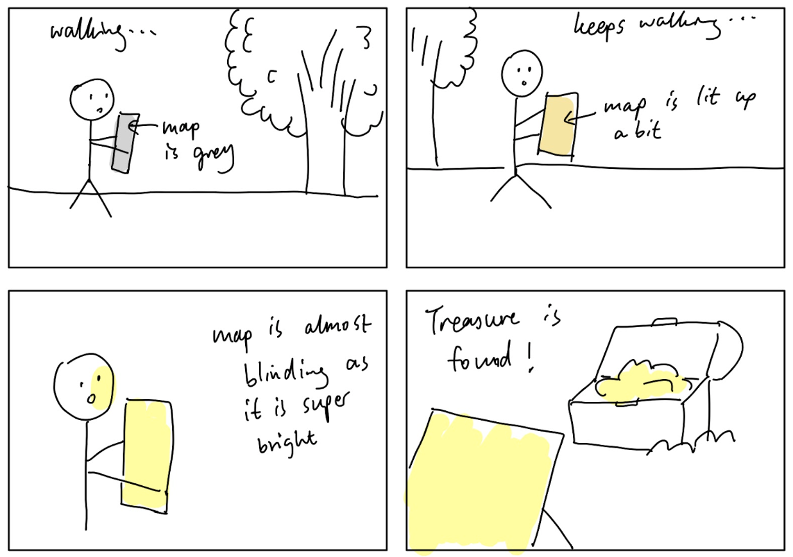
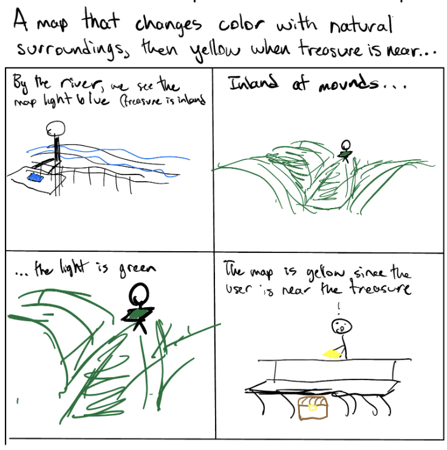
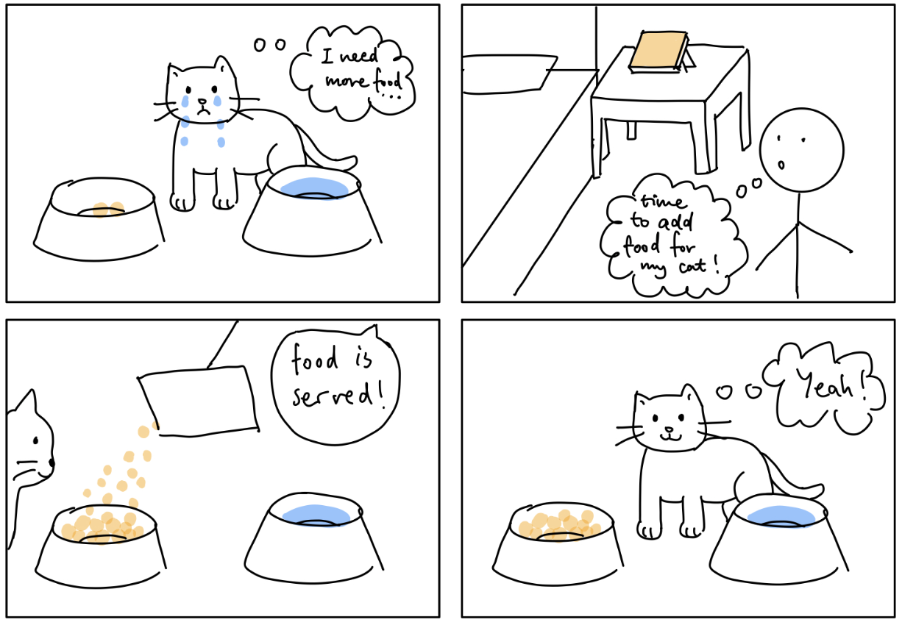
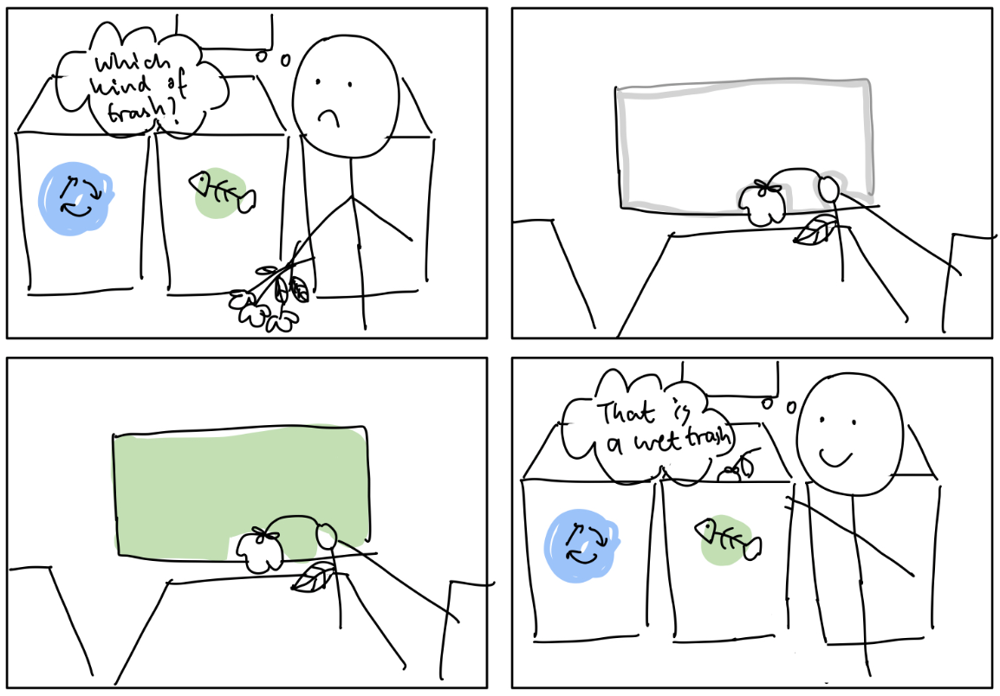
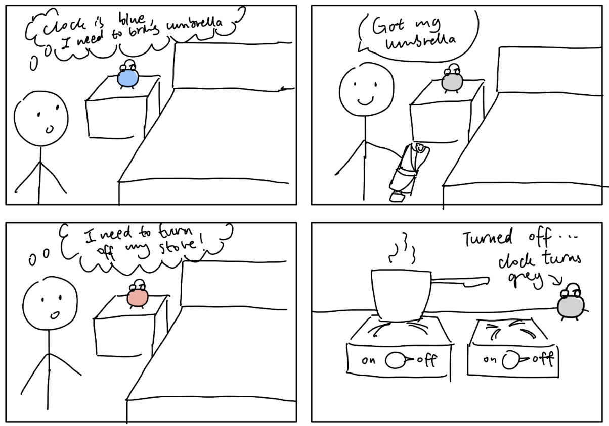
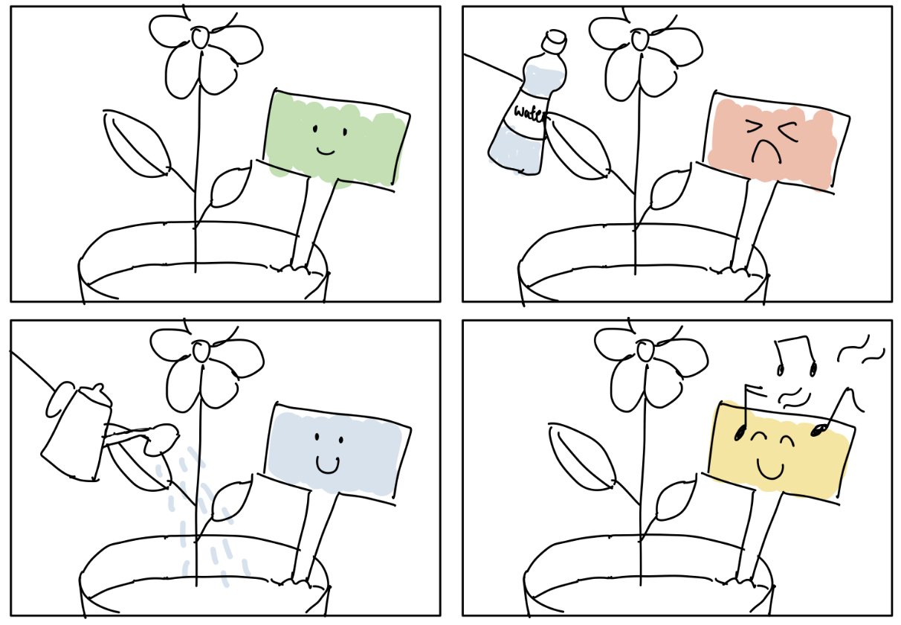
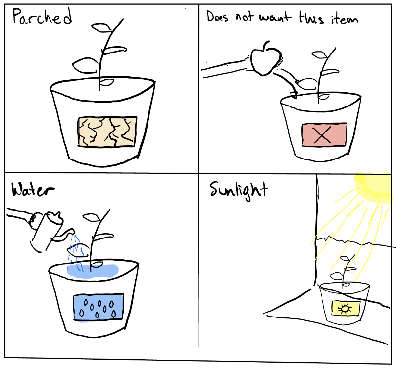
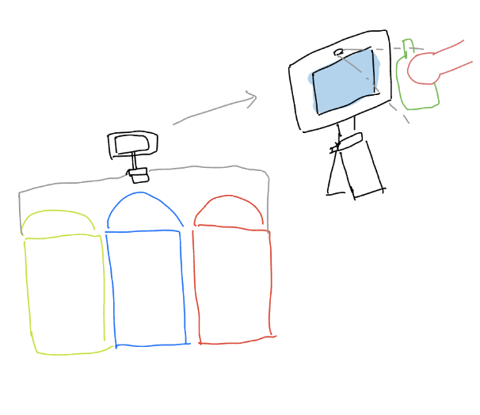
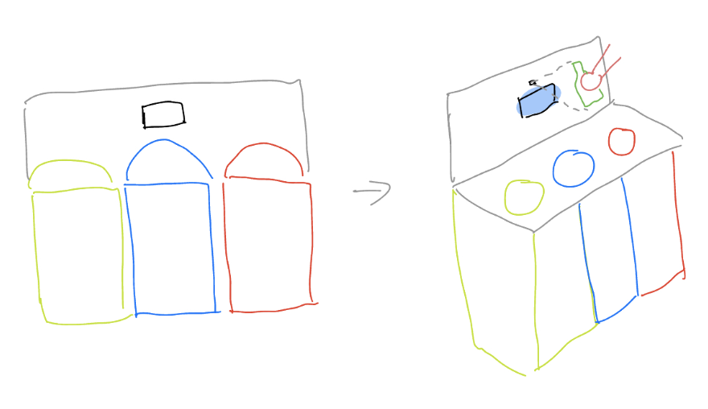
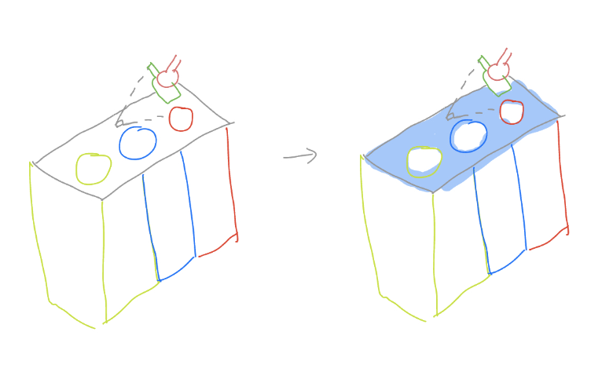

# Staging Interaction

\*\***NAME OF COLLABORATORS HERE**\*\*

_Kazim Jafri (khj23)_  
_Re (rc884)_  
_Thomas (tfw29)_  
_Zixin (zl865)_  

In the original stage production of Peter Pan, Tinker Bell was represented by a darting light created by a small handheld mirror off-stage, reflecting a little circle of light from a powerful lamp. Tinkerbell communicates her presence through this light to the other characters. See more info [here](https://en.wikipedia.org/wiki/Tinker_Bell). 

There is no actor that plays Tinkerbell--her existence in the play comes from the interactions that the other characters have with her.

For lab this week, we draw on this and other inspirations from theatre to stage interactions with a device where the main mode of display/output for the interactive device you are designing is lighting. You will plot the interaction with a storyboard, and use your computer and a smartphone to experiment with what the interactions will look and feel like. 

_Make sure you read all the instructions and understand the whole of the laboratory activity before starting!_

## Prep

### To start the semester, you will need:
1. Read about Git [here](https://git-scm.com/book/en/v2/Getting-Started-What-is-Git%3F).
2. Set up your own Github "Lab Hub" repository to keep all you work in record by [following these instructions](https://github.com/FAR-Lab/Developing-and-Designing-Interactive-Devices/blob/2021Fall/readings/Submitting%20Labs.md).
3. Set up the README.md for your Hub repository (for instance, so that it has your name and points to your own Lab 1) and [learn how to](https://guides.github.com/features/mastering-markdown/) organize and post links to your submissions on your README.md so we can find them easily.

### For this lab, you will need:
1. Paper
2. Markers/ Pens
3. Scissors
4. Smart Phone -- The main required feature is that the phone needs to have a browser and display a webpage.
5. Computer -- We will use your computer to host a webpage which also features controls.
6. Found objects and materials -- You will have to costume your phone so that it looks like some other devices. These materials can include doll clothes, a paper lantern, a bottle, human clothes, a pillow case, etc. Be creative!

### Deliverables for this lab are: 
1. 7 Storyboards
1. 3 Sketches/photos of costumed devices
1. Any reflections you have on the process
1. Video sketch of 3 prototyped interactions
1. Submit the items above in the lab1 folder of your class [Github page], either as links or uploaded files. Each group member should post their own copy of the work to their own Lab Hub, even if some of the work is the same from each person in the group.

### The Report
This README.md page in your own repository should be edited to include the work you have done (the deliverables mentioned above). Following the format below, you can delete everything but the headers and the sections between the **stars**. Write the answers to the questions under the starred sentences. Include any material that explains what you did in this lab hub folder, and link it in your README.md for the lab.

## Lab Overview
For this assignment, you are going to:

A) [Plan](#part-a-plan) 

B) [Act out the interaction](#part-b-act-out-the-interaction) 

C) [Prototype the device](#part-c-prototype-the-device)

D) [Wizard the device](#part-d-wizard-the-device) 

E) [Costume the device](#part-e-costume-the-device)

F) [Record the interaction](#part-f-record)

Labs are due on Mondays. Make sure this page is linked to on your main class hub page.

## Part A. Plan 

To stage an interaction with your interactive device, think about:

_Setting:_ Where is this interaction happening? (e.g., a jungle, the kitchen) When is it happening?

_Players:_ Who is involved in the interaction? Who else is there? If you reflect on the design of current day interactive devices like the Amazon Alexa, it’s clear they didn’t take into account people who had roommates, or the presence of children. Think through all the people who are in the setting.

_Activity:_ What is happening between the actors?

_Goals:_ What are the goals of each player? (e.g., jumping to a tree, opening the fridge). 

The interactive device can be anything *except* a computer, a tablet computer or a smart phone, but the main way it interacts needs to be using light.

**Storyboard 1: Maze**
- Setting: Treasure Island (Mysterious Maze Treasure Hunt)
- Players: Guy1 (unfamiliar with the map), Guy2 (familiar with the map)
- Activity: They are trying to figure out how to use the map. The map lights up the closer you get to the treasure. 
- Goals: To find the treasure using the map (our devices), which gradually illuminates the area ahead to help the user find the correct path.  
A user with a map (dude 1) is exploring unknown terrain. His map changes colors, but as he approaches the treasure he so dearly desires, the map becomes brighter and brighter until it is almost blinding. He is close to the treasure he is looking for.

**Storyboard 2: Treasure hunt again, no maze**
- Setting: Treasure Island (Mysterious Treasure Hunt)
- Players: explorer with lighting-up map 
- Activity: They are exploring the island. The map lights up corresponding to the colors of the natural environment. However, when close to treasure, the map will light up yellow 
- Goals: To find the treasure using the map (our devices), which gradually illuminates the area ahead to help the user find the correct path.

**Storyboard 3: Pet feeding reminder**
- Setting: The homes of pet owners.
- Players: The owner of a pet (e.g. a dog or cat), pet.
- Activity: The device can be placed at a place where the user will often be around, for example beside their bed. When there is not enough food or water in the pet’s bowl, the device will light up according to what is about to run out (e.g. yellow for food and blue for water). This way, the user will remember to add more food/water for the pet even if they do not walk to the pet’s bowls.
- Goals: To help remind pet owners to add food/water for their pets. 

**Storyboard 4: Trash Sorter**
- Setting: The refuse room in buildings in Shanghai. (Shanghai has a mandatory sorting scheme, requiring residents to separate trash into four categories: recyclable, hazardous, wet (perishable) and dry (other) waste, and many people are confused by these categories)
- Players: A person who is wanting to throw away trash according to categories.
Activity: When the user shows the trash to the trash sorter, the trash sorter will respond to which kind of trash it is by chasing color. For example blue for recyclable trash, green for wet trash, etc.
- Goals: To help the user categorize the kinds of trash, so they can throw trash into the correct bins. 

**Storyboard 5: Magical Reminder Clock**
- Setting: Bedroom of any person with a magical clock
- Players: A person and his magical reminder clock
- Activity: The magical reminder flashes colors to remind the user to do several actions. It changes colors and makes noise to tell the user what to do. Eg. 
- Goals: Get the user to do the action that the reminder is trying to remind the user to do. 

**Storyboard 6: Smartplant Reader**
- Setting: Just any room with a plant and a person
- Players: A person who owns a plant
- Activity: The person is figuring out what a plant likes by attempting several actions towards the plant (watering it or feeding it)
- Goals: Get the plant happy and growing  
So we have a dude who is surprised to see a plant in his room. He sees it is sad so he tries to offer it food. The plant is angry at the offering. The man then offers the plant some water in a bottle and the plant looks neutral. The man finally sprinkles water on the plant and the plant becomes happy. The plant also likes music :D. It gets sad around arguing.

**Storyboard 7: Plants again but tinkerbell is the pot itself rather than an attachment**
- Setting: Just any room with a plant and a person
- Players: A person who owns a plant
- Activity: The person is figuring out what a is good for the plant by attempting several actions towards the plant (watering it, feeding it, providing sunlight) and responding to pot’s assessments
- Goals: Get the plant happy and growing  
So we have a person who is surprised to see a plant in his room. In this scenario, the pot monitors the well-being and emotional state of the plant, and communicates to the person that it is thirsty. Offering food at first makes the pot angry. The man then offers the plant some water in a bottle and the plant looks neutral. The man finally sprinkles water on the plant and the plant becomes happy. The plant also likes music :D. It gets sad around arguing.

**Summarize feedback you got here.**

Based on asking around, we were able to get limited feedback around our ideas, particularly around the first idea we were told it seemed interesting and asking the TA were told it covered all of our basic requirements. From that idea we created the rest of the six and we found out that they were kind of interesting and fun ideas. We learned that we could definitely be a bit more creative since some of the ideas are rather similar. We will take it into consideration (next week!).

## Part B. Act out the Interaction

Try physically acting out the interaction you planned. For now, you can just pretend the device is doing the things you’ve scripted for it. 

**Are there things that seemed better on paper than acted out?**
We chose storyboard 4 (Garbage sorter) to act out. One challenge was finding the right trash can setup on campus that would be the best to communicate the interaction to users. The first garbage we found only had two bins to place items into and limited signage describing what was meant to go in each bin. Thus, we’ve found a garbage bin in Bloomberg that has three receptacles (paper recycle, plastic recycle, and landfill) plus an extra bin we use to represent compost. Another thing that will be important to do right is the blocking, specifically making sure that the interactions (scanning the food, placing the food into the trash, etc.) don’t block the view of the bin signs and our screen/device when recording.
When we act out the interaction, we have to think more about the position of the device, where it is placed so the user can see it better. We originally thought we might place the screen/scanner on the trash bin (and thus below the opening), but it turned out to be very awkward to bend down and wave garbage below the bin. It will make more sense to position the screen/scanner higher so that you wave your garbage above the bins, near where you’ll end up tossing the garbage.
**Are there new ideas that occur to you or your collaborators that come up from the acting?**
We can add more trash types. Particularly compost. 

## Part C. Prototype the device

You will be using your smartphone as a stand-in for the device you are prototyping. You will use the browser of your smart phone to act as a “light” and use a remote control interface to remotely change the light on that device. 

Code for the "Tinkerbelle" tool, and instructions for setting up the server and your phone are [here](https://github.com/FAR-Lab/tinkerbelle).

We invented this tool for this lab! 

If you run into technical issues with this tool, you can also use a light switch, dimmer, etc. that you can can manually or remotely control.

**Give us feedback on Tinkerbelle.**

Tinkerbelle works well but has a small problem. We can't save the colors we choose. So, every time we use it, we have to pick the colors again if we don't want to use the default ones. It would be better if we could save our favorite colors.

## Part D. Wizard the device
Take a little time to set up the wizarding set-up that allows for someone to remotely control the device while someone acts with it. Hint: You can use Zoom to record videos, and you can pin someone’s video feed if that is the scene which you want to record. 
**Include your first attempts at recording the set-up video here.**
**Show the follow-up work here.**
Our first attempt at setting it up was a successful attempt so it will be included in the final video.

## Part E. Costume the device

Only now should you start worrying about what the device should look like. Develop three costumes so that you can use your phone as this device.

Think about the setting of the device: is the environment a place where the device could overheat? Is water a danger? Does it need to have bright colors in an emergency setting?

**Include sketches of what your devices might look like here.**
 - Clip-on device with screen

 - Embedded screen 1

 - Embedded screen 2

**What concerns or opportunities are influencing the way you've designed the device to look?**
The main concern was not being able to confuse the device as trash itself. Another concern would be potential contamination from trash being moved over the device. There is potential for water from a water bottle to drip onto the device causing potential water damage. It needs to be dressed to not look like something to throw away as well as be protected from potential garbage, but the latter may be solved with better placement.

## Part F. Record

\*\***Take a video of your prototyped interaction.**\*\*
Our video: https://youtu.be/y4Ni2OnUtK4

**Please indicate anyone you collaborated with on this Lab.**
Thomas Wiener (tfw29)  
Zixin Li (zl865)  
Kazim Jafri (khj23)  
Rei Chen (rc884)  

# Staging Interaction, Part 2 

This describes the second week's work for this lab activity.

## Prep (to be done before Lab on Wednesday)

You will be assigned three partners from another group. Go to their github pages, view their videos, and provide them with reactions, suggestions & feedback: explain to them what you saw happening in their video. Guess the scene and the goals of the character. Ask them about anything that wasn’t clear. 

\*\***Summarize feedback from your partners here.**\*\*

## Make it your own

Do last week’s assignment again, but this time: 
1) It doesn’t have to (just) use light, 
2) You can use any modality (e.g., vibration, sound) to prototype the behaviors! Again, be creative! Feel free to fork and modify the tinkerbell code! 
3) We will be grading with an emphasis on creativity. 

\*\***Document everything here. (Particularly, we would like to see the storyboard and video, although photos of the prototype are also great.)**\*\*
